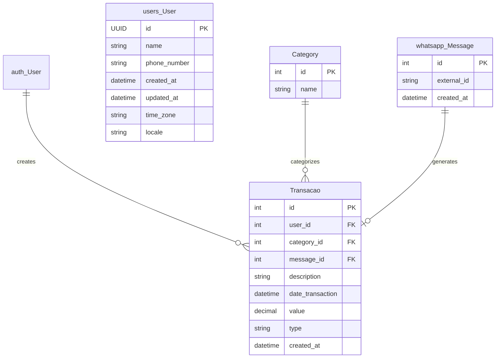
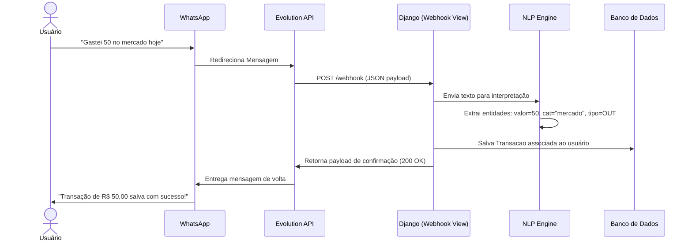
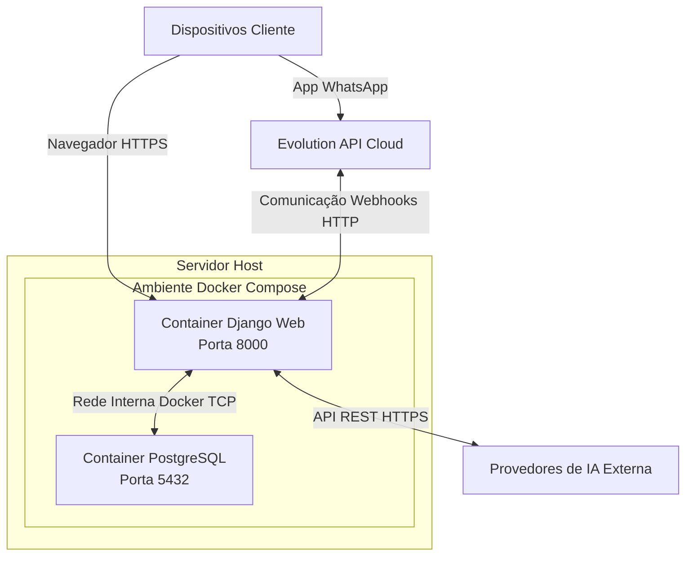

# Diagramas Arquiteturais - Assistente Financeiro

Abaixo estão os diagramas representando a arquitetura, estrutura de dados, implantação e fluxos do Assistente Financeiro, baseados no escopo de evolução (incluindo NLP, Dashboard e integrações).

## 1. Diagrama Entidade-Relacionamento (ERD)
Modela as tabelas do banco de dados e suas cardinalidades. Repare que a tabela `Transacao` aponta para `auth_User` (padrão do Django), e o sistema também possui uma tabela `User` específica do app `users` independente para outros fins.



## 2. Diagrama de Classes (UML)
Representação dos Models da aplicação, seus atributos principais e a associação entre as classes lógicas do sistema Django.

```mermaid
classDiagram
    class User {
        +UUID id
        +CharField name
        +CharField phone_number
        +DateTimeField created_at
        +DateTimeField updated_at
        +CharField time_zone
        +CharField locale
    }
    class Category {
        +int id
        +CharField name
        +__str__()
    }
    class Message {
        +int id
        +CharField external_id
        +DateTimeField created_at
        +__str__()
    }
    class Transacao {
        +int id
        +ForeignKey user
        +ForeignKey category
        +ForeignKey message
        +CharField description
        +DateTimeField date_transaction
        +DecimalField value
        +CharField type
        +DateTimeField created_at
        +save()
        +__str__()
    }
    Transacao --> "auth.User"
    Transacao --> Category
    Transacao --> Message
```

## 3. Diagrama de Componentes
Demonstra os grandes blocos lógicos da aplicação e como eles se comunicam para processar as transações, rodar a inteligência de NLP e servir o Dashboard.

```mermaid
graph TD
    subgraph Assistente Financeiro [Sistema Interno Django]
        WA[Módulo WhatsApp / Webhooks]
        Dash[Módulo Dashboard / API REST]
        NLP[Módulo NLP / Parser]
        TM[Módulo Gestor de Transações]
        RG[Módulo Gerador de Insights]
    end
    
    DB[(PostgreSQL)]
    Evo((Evolution API))
    LLM((Serviço LLM/GLiNER externo))

    Evo <-->|Webhooks POST / Envio| WA
    WA -->|Mensagem bruta| NLP
    NLP <-->|Requisição de Extração| LLM
    NLP -->|Dados Estruturados| TM
    TM <-->|Leitura/Escrita via ORM| DB
    Dash <-->|Consulta endpoints (API)| TM
    Dash -->|Geração Relatório| RG
    RG <-->|Consulta Histórico (Aggregate)| DB
```

## 4. Diagrama de Sequência (UML Comportamental)
Mapeia o fluxo assíncrono de quando o usuário envia uma mensagem de gasto até a resposta de confirmação do bot, ilustrando a cadeia de responsabilidade.



## 5. Diagrama de Implantação
Representação física de como o sistema e a infraestrutura estão distribuídos. No caso deste projeto, baseado num ambiente Docker.


